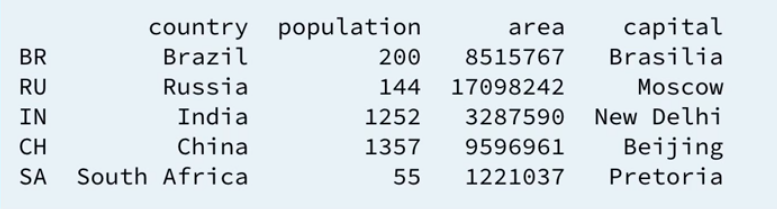

### Python

The / operator performs floating point division. It returns a float even if both the numerator and
denominator are ints.

The // operator performs a quirky kind of integer division. When the result is positive, you can think of it as truncating (not rounding) down to 0 decimal places, but be careful with that.

```python
print(5 // 2 )
# 2
print(-11 // 2)
# -6
```

The ** operator means “raised to the power of.” 

```Python
print(11 ** 2)
# 121
```

#### Output

Formatted output (printf equivalent)

```python
print("%s: %d %d %d %d %d" % (key, wins[key] + loses[key] + draw[key], wins[key], draw[key], 		loses[key], scores[key]))
```

#### Data types

1. **Booleans** are either True or False.

2. **Numbers** can be integers (1 and 2), floats (1.1 and 1.2), fractions (1/2 and 2/3), or even complex
  numbers.
3. **Strings** are sequences of Unicode characters, e.g. an H T M L document.
4. **Bytes ** and byte arrays, e.g. a J P E G image file.
5. **Lists** are ordered sequences of values.
6. **Tuples** are ordered, immutable sequences of values.
7. **Sets** are unordered bags of values.
8. **Dictionaries** are unordered bags of key-value pairs.

Data types are converted between each other with functions like int(), str(), float() etc.

####Lists

```python
# creating a list
a_list = ["a", "b", "test"]
# slicing 
a_list[0:3] # ["a", "b", "test"]
a_list[0:] # ["a", "b", "test"]
a_list[:3] # ["a", "b", "test"]
a_list[-3:-1] # ['a', 'b']

# slicing also can be used for replacing multiple elements at once
slice_example = ["1", "2", "3"]
slice_example[0:2] = ["2", "4"]
print(slice_example) # [2, 4, 3]

# adding items
a_list += ["s"] # create new list and assign it to a a_list variable
print(a_list) # ['a', 'b', 'test', 's']

a_list.append("ss") # ['a', 'b', 'test', 's', 'ss']

a_list.extend([1, 2, 3]) # appends each element, doesnt' create new list
# ['a', 'b', 'test', 's', 'ss', 1, 2, 3] 

a_list.clear() 

a_list.insert(0, 1)
a_list.insert(1, "a")
a_list.insert(2, "b")
# [1, 'a']

a_list.count("a") # a
"a" in a_list # True
a_list.index("a") # 1

# removing an item
del a_list[1] # remove specified element ("a")
a_list.remove("b") # remove first occurance
a_list.pop() # returns 1 
```

**List comprehension** - convenient way of mapping one list into another (transformed). Basically, works like a map() function but can be combined with conditions. There are also dictionary and set comprehensions available.

```python
[(x, y) for x in [1,2,3] for y in [3,1,4] if x != y] 
# [(1, 3), (1, 4), (2, 3), (2, 1), (2, 4), (3, 1), (3, 4)] (Cartesian product)
```

####Tuples

A tuple is an **immutable** list. A tuple can not be changed in any way once it is created.

```python
tup = (1, 2, 3)
# no append(), extend(), insert(), remove(), and pop() methods, but non-modifying methods work as usual
a_list = list(tup) # convert tuple to list
a_tuple = tuple(a_list) # and vice versa
(x, y, z) = ("1", 1, True) # Multi-assignment
x # '1'
y # 1
z # True
(MONDAY, TUESDAY, WEDNESDAY, THURSDAY, FRIDAY, SATURDAY, SUNDAY) = range(7)
MONDAY # 0
TUESDAY # 1
```

1. Tuples are faster than lists. If you’re defining a constant set of values and all you’re ever going to do with it is iterate through it, use a tuple instead of a list.
2. Some tuples can be used as dictionary keys (specifically, tuples that contain immutable values like strings ,numbers, and other tuples). Lists can never be used as dictionary keys, because lists are not immutable.

####Sets

A set is an **unordered “bag”** of unique values. A single set can contain values of any immutable datatype.
Once you have two sets, you can do standard set operations like union, intersection, and set difference.

``` python
a_set = {1, 2, 3} 
print(a_set) # {1, 2, 3}
type(a_set) # <class 'set'>
a_list = ['a', 'b', 'mpilgrim', True, False, 42]
a_set = set(a_list)
a_set # {'a', False, 'b', True, 'mpilgrim', 42} - unordered

a_set.discard(4) # does nothing if the element wasn't found 
a_set.remove(4) # raises an exception
```

Common set operations

```python
result = a_set.union(b_set) # result will be a_set + b_set
result = a_set.intersection(b_set) # common elements
result = a_set.difference(b_set) # elements, which are in a but not b
result = a_set.symmetric_difference(b_set) # all the elements that are in exactly one of the sets.
a_set = {1, 2, 3}
b_set = {1, 2, 3, 4}
result = a_set.issubset(b_set) # True
result = b_set.issuperset(a_set) # True
```

####Dictionaries

```python
SUFFIXES = {1000: ['KB', 'MB', 'GB', 'TB', 'PB', 'EB', 'ZB', 'YB'],
1024: ['KiB', 'MiB', 'GiB', 'TiB', 'PiB', 'EiB', 'ZiB', 'YiB']}
len(SUFFIXES) # 2
1000 in SUFFIXES # True
SUFFIXES[1000] # ['KB', 'MB', 'GB', 'TB', 'PB', 'EB', 'ZB', 'YB']
```

#### Files

```python
# with automatically closes file for you
with open("test.txt") as inf:
    # strip removes all the stuff like \n \t
    s1 = inf.readLine().strip()
    s2 = inf.readLine().strip()

with open("test.txt") as inf:
	# read all lines
    for line in inf:
        line = line.strip()
        print(line)

# w stands for write
with open("test.txt", "w") as inf:
	# read all lines
    for i in range(0, 10):
        inf.write(str(i))
```

#### numpy

Used for convenient way of manipulating arrays (addition, division, matrices multiplication, etc)

```python
import numpy as np
np_2d = np.array([[1,2,3], 
                  [4,5,6]])
np_2d.shape # 2, 3 - 2 rows 3 columns
np_2d[0, 2] # 3
np_2d[:, 1:3] # 2d array intersection (all rows, columns 1-2 (3 excluded)) [[2,3], [5,6]]

np.mean(np_array) # average
np.median(np_array) # median
np.std(np_array) # standart deviation
np.corrcoef(np_array_1, np_array_2) # correlation coefficient 
```

#### matplotlib (pyplot)

Used for building both scatter and plot graphics

```python
import matplotlib.pyplot as plt
plt.plot(list_1, list_2) # list_1 on x axis and list_2 on y
plt.show() # result - line plot
plt.clf()
plt.scatter(list-1, list_2, s = np_array_1, c = np_array_2, alpha = 0.8) # s stays here for scaling list (coefficients), c - for colors, alpha - for opacity

plt.xscale("log") # change x axis scaling for large numbers 
plt.show() # result - scatter plot with points, not connected with lines
plt.clear()

plt.hist(np_array_1, bins=3) # create a histogram
plt.clear()

plt.fill_between() # a line plot, where the area under the graph is colored
plt.xlabel("x-axis title") # sign axis
plt.ylabel("y-axis title")
plt.title("Awesome plot") # title our plot
plt.yticks([0,1,2], ["one","two","three"]) # control y-axis and some friendly names
plt.grid(True) # add grids
```

https://matplotlib.org/1.5.1/gallery.html - big collection of plot examples

#### Pandas

Pandas is a high level data manipulation tool. In pandas we store data in so-called dataframe. 



Data is imported to dataframe typically from the CSV file:

```python
import pandas as pd
data = pd.read_csv("data.csv", index_col=0) # index_col used for telling that our first row contains indexes
data["columnname"] # returns data for specific column
data.columnname # the same
data["nextcolumn"] = ["a", "b", "c"] # add column
data["nextcolumn2"] = data["columnname"] + data["nextcolumn"] * 2 # add column based on other columns
data.loc[1] # take the row indexed 1

data.loc["key"] # take the row with index "key"
data.loc["key"]["columnname"] # take the concrete value for this row (one cell)
data.loc["key"]["columnname"] # similar to previous

```

